# Memo Minder Gamfied Task Manage Web
A student life website for universities and colleges.

## Project Description
- **Project Type**: 
Master School Project in University of Waterloo ECE 651 - gamified task management platform. 
- **Project Motivations**: 
MemoMinder was developed to address the lack of robust motivational mechanisms in existing task management tools. By integrating gamification and social interaction, the goal was to create a more engaging and enjoyable experience for users, helping them improve productivity and build healthy habits.

## Project Summary
- **Completed Functionalities**:.  
User authentication (login and registration).  
Profile management with avatar customization.  
Task management (Habits, Dailies, and To-Dos).  
Reward system with coins and experience points.  
Store for purchasing items and weapons.  
Boss challenges for motivational milestones.  
Milestone achievement tracking.  
Real-time interactions and updates.  

- **Project Goal**: .  
To develop a user-friendly task management platform that offers an enjoyable experience in organizing and completing tasks while fostering community interaction and motivation.
- **Language Package**: 
**Frontend**: *React, Javascript, HTML, CSS* 
**Backend**: *Node.js, MongoDB* 
  
## Project Feature
**1. Login and Registration**

  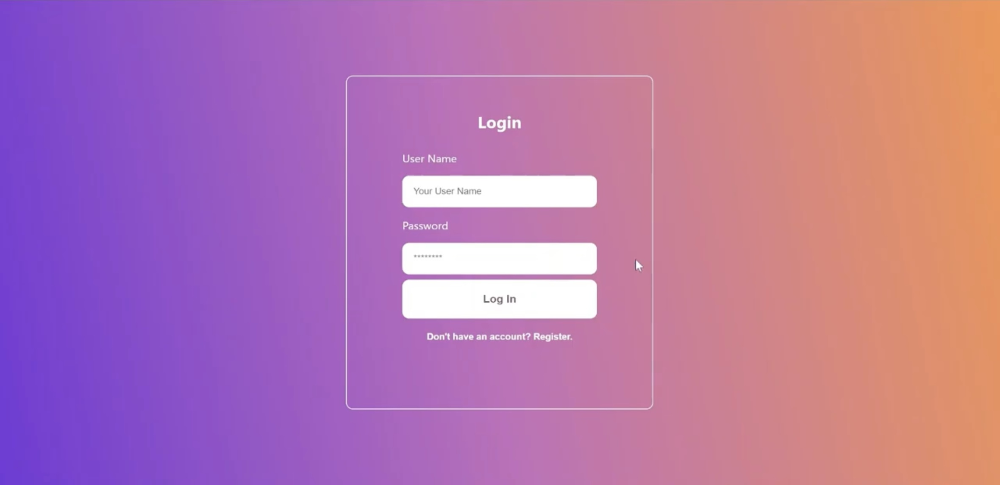
  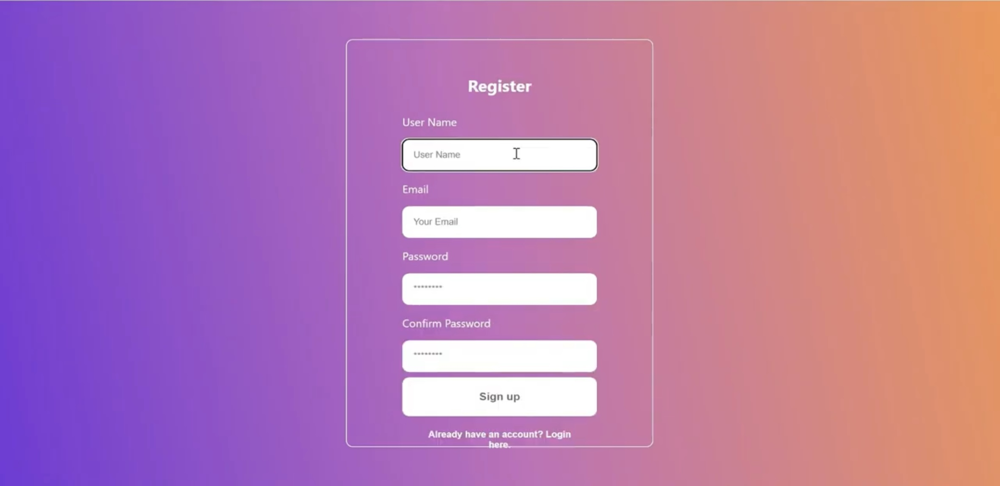

This feature allows users to sign up and log in to the MemoMinder platform securely. It ensures that only authenticated users can access the platform's functionalities and protects user data.  

**2. Profile Management**

  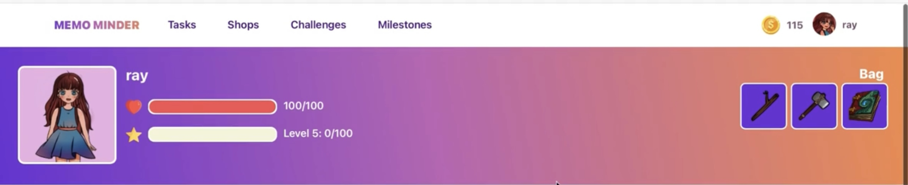

The profile page includes detailed user information such as health points, experience points, inventory, coins, and avatar customization. Users can track their progress, view and equip items from their inventory, and see their character's development.  

**3. Task Management**

  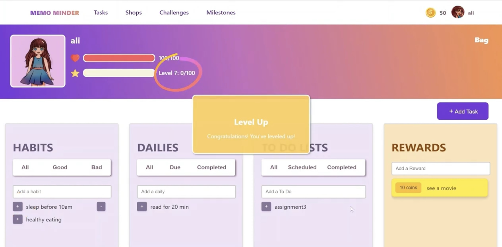
  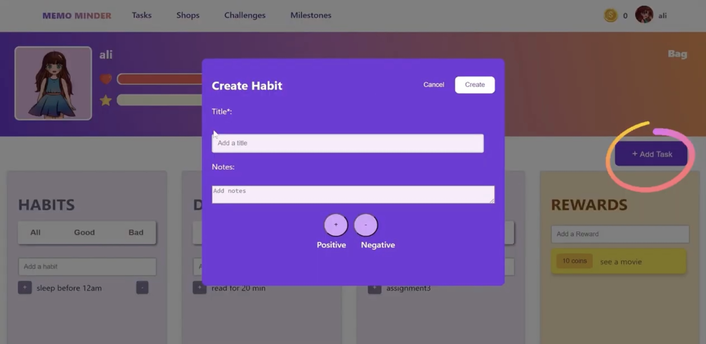
  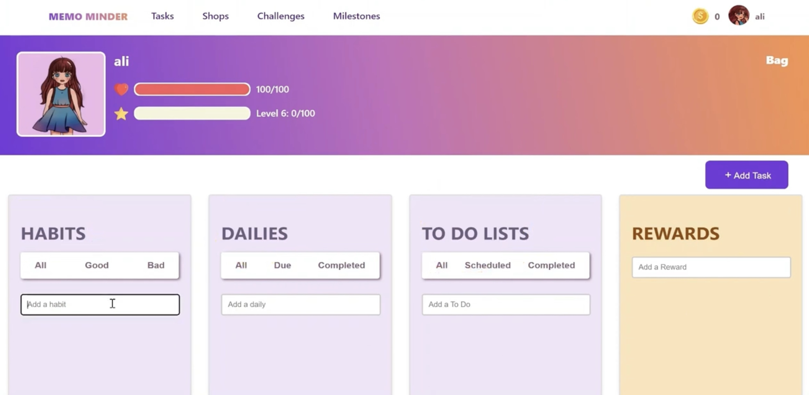
  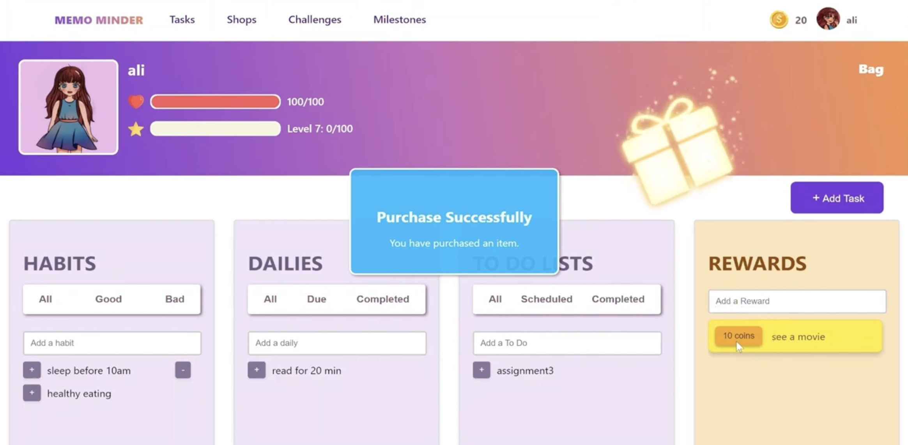

Tasks are categorized into three types: Habits, Dailies, and To-Dos. Users can add and delete tasks as needed. Completing tasks rewards users with experience points, coins, and achievement points while failing to complete them results in a loss of health points. Users can also use coins to redeem real-life rewards, such as eating a cake.  

**4. Store**

  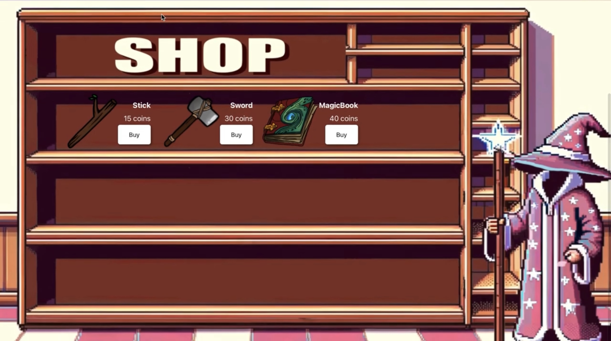
  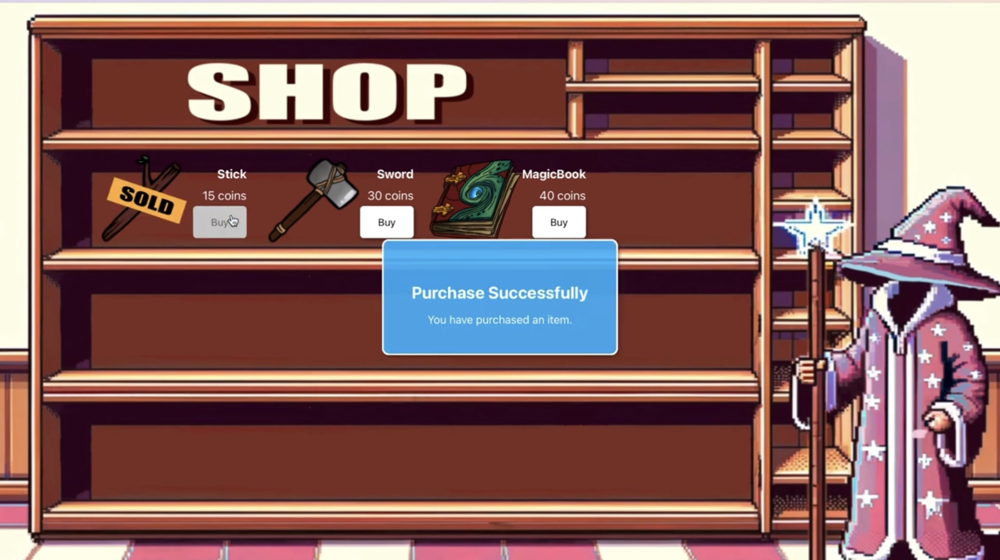

Users can purchase weapons and items using coins earned from completing tasks. These items can be used in boss challenges and are stored in the user's inventory. Items can be equipped to the user's avatar to enhance their abilities.  

**5. Challenge**

  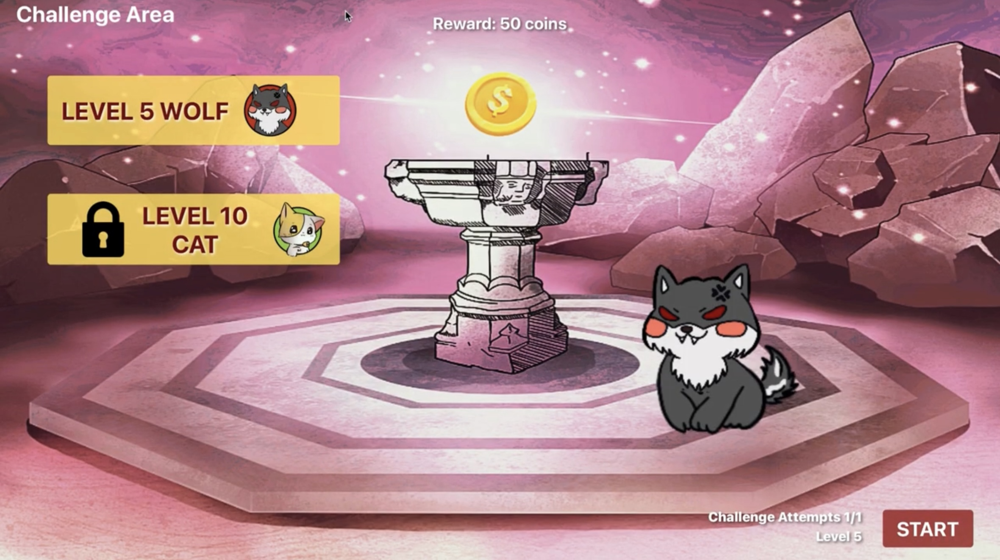
  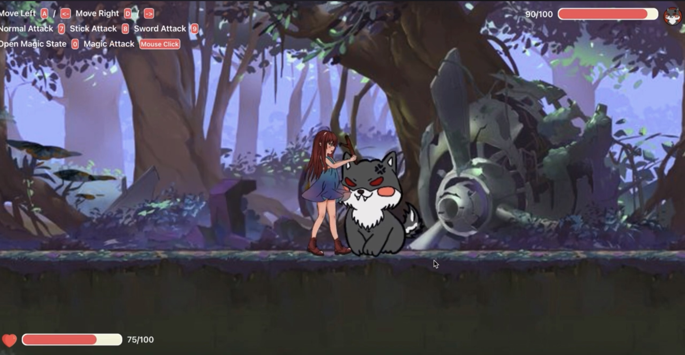
  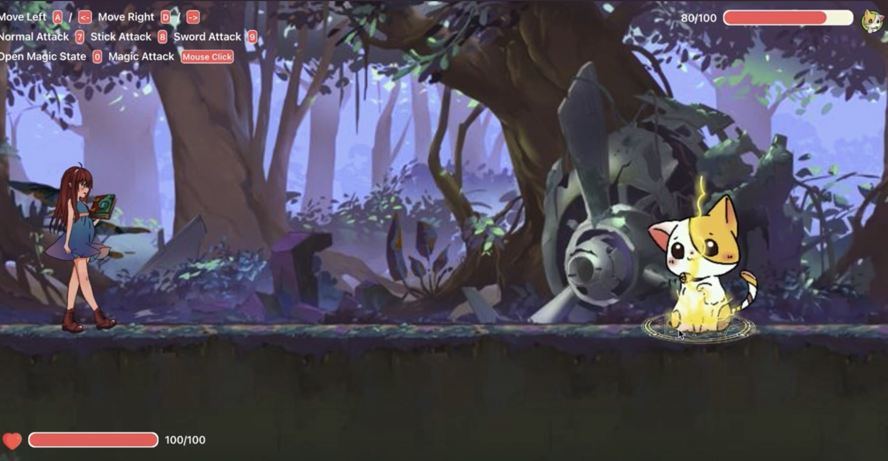
  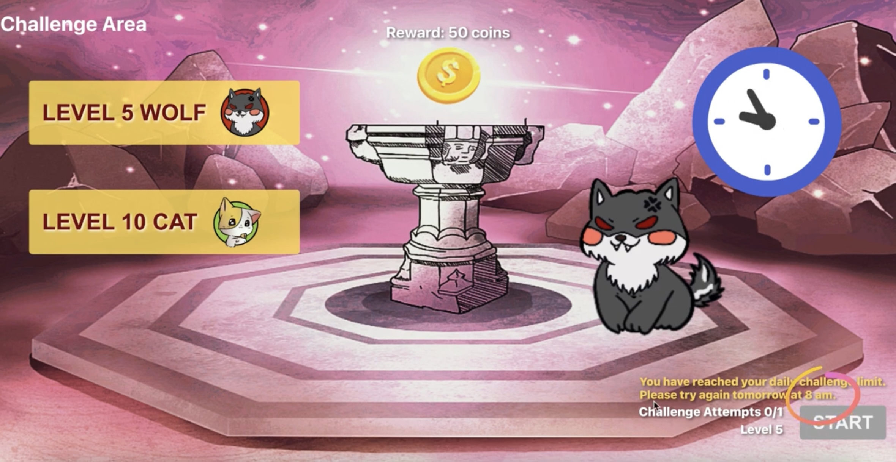

As users reach certain levels, they unlock boss challenges. Defeating bosses rewards users with coins and achievement points. This feature adds a layer of excitement and motivation for finishing tasks to earn experience, unlocking more levels.  

**6. Milestone Achievement Page**

  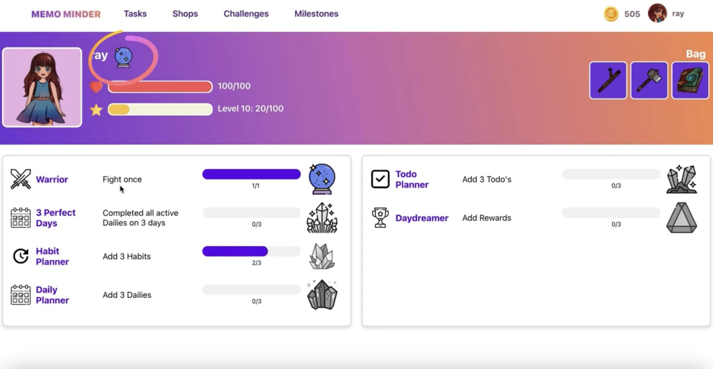

Achievements are awarded based on accumulated achievement points. The milestone achievement page displays the user's accomplishments and milestones, which are also visible on the user's profile. This feature encourages users to strive for continuous improvement and rewards their dedication.  

- **Designed Mindmap**

  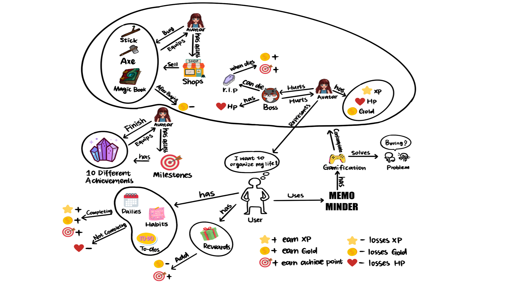

  

- **Environment Setup**: 
To run the project, you need to set up the following environment:  
**Node.js and npm**: Ensure you have *Node.js* (version 14.x or above) and *npm* installed. 
**Python and pip**: Ensure you have *Python* (version 3.x) and *pip* installed. 
**MongoDB**: Install and run MongoDB for database management.
**Clone Repository**: Clone the project repository from GitHub. 
**Install Dependencies for Node.js**: Navigate to the frontend directory and run *npm install* to install the required packages. 
**Run the Application**: Start the *Django server* with *python manage.py runserver* in the backend directory and start the *Node.js server* with *npm start* in the frontend directory. 

## Iterative Design
- **Unit Test**:
Implemented unit tests using *Jest* to ensure the reliability of individual components. Focused on testing user authentication, task creation, and real-time interactions. Additionally, 5 users tested the application for 8 rounds, providing valuable feedback for further improvements.

- **Improvements**: 
**Bug Fix: Purchased Items in Inventory**:  
Fixed a bug where purchased weapons did not appear in the profile inventory after purchase. 
**Purchase Button and Sold Status**: 
Updated the purchase button for sold weapons to a disabled status.  
**Game Balance - Boss Challenges**:  
status and replaced the weapon image with a "sold" image. This ensures users understand that a weapon only needs to be purchased once. 
**User Movement Speed and Boss Difficulty**: 
Increased the user's movement speed within the game.
Slightly lowered the difficulty of defeating bosses to keep the game balanced and enjoyable. 
**Health Points Bug Fix**: 
Fixed a bug where the health points displayed on the profile page were not correctly linked to the health points during boss battles. 

## Video Demo
[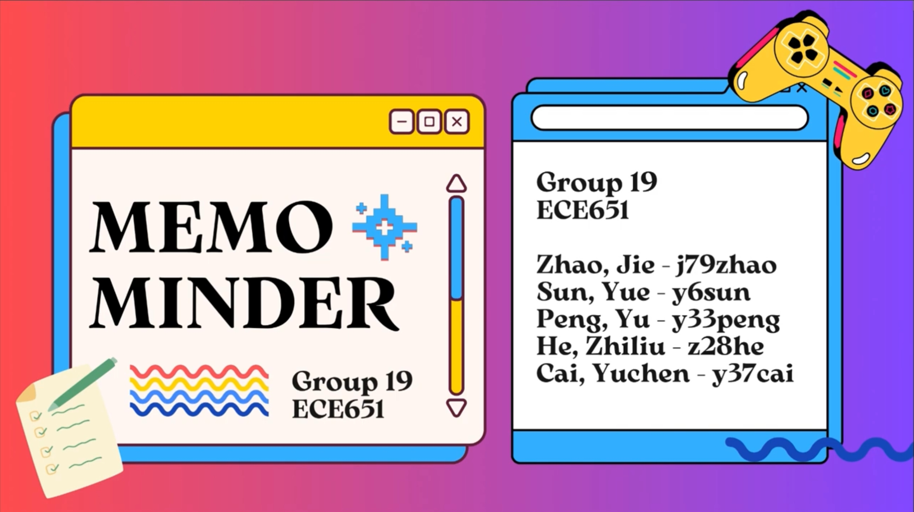](https://www.youtube.com/watch?v=hO9mPRVtdzo)

 * video link: [https://www.youtube.com/watch?v=SeSH-yGvLrM](https://www.youtube.com/watch?v=hO9mPRVtdzo)

